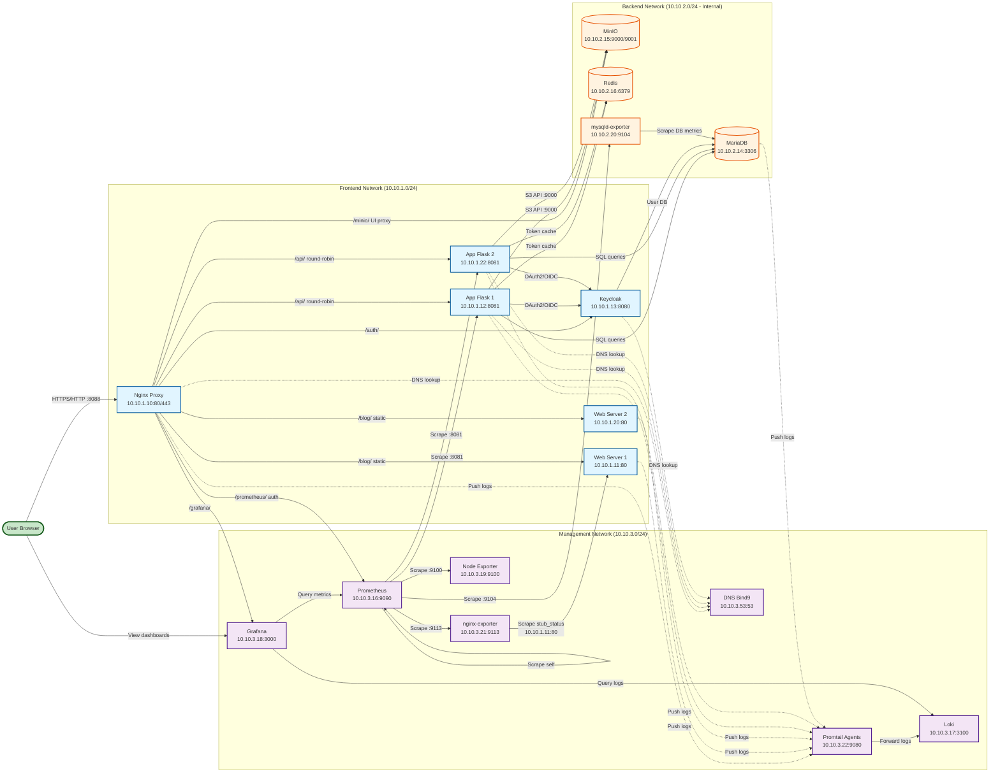

# MiniCloud — Kiến trúc hạ tầng & bảo mật

Tài liệu mô tả **toàn bộ stack** dự án MiniCloud: mạng, container, DNS nội bộ, reverse proxy, lưu trữ, giám sát, và **cách triển khai các lớp bảo mật** (phân vùng, bí mật, cổng vào). Cuối file là **hướng dẫn chạy** từ máy dev.

---

## 1. Tổng quan

MiniCloud là một cụm **Docker Compose** gồm **16 container**, chạy trên **3 mạng ảo** để tách:

- lớp **người dùng / HTTP** (web1, web2, API Flask 1 & 2, auth) — **frontend-net**,
- lớp **dữ liệu** (MariaDB, MinIO, Redis) **không ra Internet** — **backend-net**,
- lớp **vận hành** (DNS, Prometheus, Grafana, Loki, Promtail, exporters) — **mgmt-net**.

**Cổng mở ra máy host (theo `docker-compose.yml`):**

| Cổng host | Dịch vụ | Ghi chú |
|-----------|---------|---------|
| `8088:80` | Nginx **Proxy** — **cửa vào duy nhất** cho toàn bộ HTTP | Bind `0.0.0.0:8088` |
| `443` | Nginx **Proxy** — HTTPS (dự phòng) | |
| `53/udp` | **Bind9** — DNS nội bộ | |

> **Lưu ý quan trọng:** Grafana (3000), MinIO Console (9001), Prometheus (9090) **không expose port ra host**. Tất cả truy cập đều qua proxy port **8088**.

---

## 2. Sơ đồ kiến trúc hệ thống



**Giải thích kiến trúc:**

- **Frontend Network (10.10.1.0/24):** Lớp tiếp xúc người dùng với Nginx Proxy làm gateway duy nhất, 2 Web servers và 2 Flask API instances cho High Availability.
- **Backend Network (10.10.2.0/24 - Internal):** Lớp dữ liệu hoàn toàn cô lập khỏi Internet, chứa MariaDB, MinIO (cả UI và API), Redis và mysqld-exporter.
- **Management Network (10.10.3.0/24):** Lớp vận hành với DNS, Prometheus (primary), Grafana, Loki, Promtail và các exporters.

**Lưu ý đặc biệt:**
- **Prometheus có 3 địa chỉ IP** (10.10.3.16 primary, 10.10.1.16, 10.10.2.21) để kết nối đến cả 3 subnets và scrape metrics từ mọi thành phần. Trong sơ đồ chỉ hiển thị IP chính (10.10.3.16) để tránh trùng lặp.
- **nginx-exporter có 2 địa chỉ IP** (10.10.3.21 primary, 10.10.1.21) để scrape stub_status từ Web1. Trong sơ đồ chỉ hiển thị IP chính (10.10.3.21).

---

## 3. Ba mạng Docker (micro-segmentation)

| Mạng | Subnet | Đặc điểm | Vai trò |
|------|--------|----------|---------|
| `frontend-net` | `10.10.1.0/24` | Bridge thông thường | Proxy, Web1/2, App Flask 1 & 2, Keycloak |
| `backend-net` | `10.10.2.0/24` | **`internal: true`** — không có default route ra Internet | MariaDB, MinIO (cả UI & API), Redis, mysqld-exporter |
| `mgmt-net` | `10.10.3.0/24` | Bridge | DNS, Prometheus, Loki, Grafana, Node Exporter, nginx-exporter, Promtail |

**Ý nghĩa bảo mật:** `backend-net` cô lập DB, object storage và cache khỏi Internet. Chỉ các service được gắn mạng này mới nói chuyện trực tiếp với DB/Storage/Redis.

---

## 4. Danh sách container & địa chỉ IP cố định

| # | Tên container | Image / build | IP (mạng) | Vai trò |
|---|--------------|---------------|-----------|---------|
| 1 | `minicloud-dns` | `build: ./bind9` | `10.10.3.53` (mgmt) | Bind9 — phân giải `*.cloud.local` |
| 2 | `minicloud-proxy` | `nginx:alpine` | `10.10.1.10` (fe), `10.10.3.10` (mgmt) | **Gateway duy nhất** — port host **8088** |
| 3 | `minicloud-web1` | `build: ./web` | `10.10.1.11` (fe), `10.10.3.11` (mgmt) | Static site — instance #1 (round-robin) |
| 4 | `minicloud-web2` | `build: ./web` | `10.10.1.20` (fe), `10.10.3.20` (mgmt) | Static site — instance #2 (round-robin) |
| 5 | `minicloud-app` | `build: ./app` | `10.10.1.12` (fe), `10.10.2.12` (be), `10.10.3.12` (mgmt) | API Flask #1 — port **8081** trong container |
| 6 | `minicloud-app2` | `build: ./app` | `10.10.1.22` (fe), `10.10.2.22` (be), `10.10.3.24` (mgmt) | API Flask #2 — port **8081** trong container (HA) |
| 7 | `minicloud-auth` | `build: ./auth` (Keycloak) | `10.10.1.13` (fe), `10.10.2.13` (be), `10.10.3.13` (mgmt) | Keycloak — HTTP **8080**, management **9000** |
| 8 | `minicloud-db` | `mariadb:10.11` | `10.10.2.14` (be), `10.10.3.14` (mgmt) | MariaDB |
| 9 | `minicloud-storage` | `minio/minio` | `10.10.2.15` (be) | MinIO — S3 API **9000**, Console **9001** (backend only) |
| 10 | `minicloud-redis` | `redis:7-alpine` | `10.10.2.16` (be) | Redis cache — port **6379** |
| 11 | `minicloud-monitoring` | `prom/prometheus` | `10.10.3.16` (mgmt), `10.10.2.21` (be), `10.10.1.16` (fe) | Prometheus — port **9090** (cross-subnet scraping) |
| 12 | `minicloud-loki` | `grafana/loki` | `10.10.3.17` (mgmt) | Loki log aggregation |
| 13 | `minicloud-grafana` | `grafana/grafana` | `10.10.3.18` (mgmt) | Grafana — port **3000** (nội bộ) |
| 14 | `minicloud-node-exporter` | `prom/node-exporter` | `10.10.3.19` (mgmt) | Metrics host — port **9100** |
| 15 | `minicloud-mysqld-exporter` | `prom/mysqld-exporter` | `10.10.2.20` (be) | MariaDB metrics — port **9104** |
| 16 | `minicloud-nginx-exporter` | `nginx/nginx-prometheus-exporter` | `10.10.3.21` (mgmt), `10.10.1.21` (fe) | Nginx metrics — port **9113** (scrape Web1) |
| 17 | `minicloud-promtail` | `grafana/promtail` | `10.10.3.22` (mgmt) | Log aggregator agent — port **9080** |

**Volumes bền vững:** `db_data` (MariaDB), `storage_data` (MinIO).

**Lưu ý:** Một số containers có nhiều IPs để kết nối cross-subnet:
- **Prometheus:** 3 IPs (mgmt primary, be, fe) để scrape metrics từ mọi subnet
- **nginx-exporter:** 2 IPs (mgmt primary, fe) để scrape stub_status từ Web1

---

## 5. DNS nội bộ (Bind9)

Tất cả service có `dns: 10.10.3.53`. Zone `cloud.local` ánh xạ tên → IP cố định.

| Hostname | IP | Ghi chú |
|----------|----|---------|
| `proxy.cloud.local` | `10.10.1.10` | Nginx Gateway |
| `web1.cloud.local` / `web-frontend-server.cloud.local` | `10.10.1.11` | Web instance #1 |
| `web2.cloud.local` | `10.10.1.20` | Web instance #2 |
| `app.cloud.local` / `app-backend.cloud.local` | `10.10.1.12` | Flask API |
| `auth.cloud.local` / `keycloak.cloud.local` | `10.10.1.13` | Keycloak |
| `db.cloud.local` | `10.10.2.14` | MariaDB |
| `storage.cloud.local` / `minio.cloud.local` | `10.10.2.15` | MinIO |
| `monitoring.cloud.local` | `10.10.3.16` | Prometheus |
| `grafana.cloud.local` | `10.10.3.18` | Grafana |
| `dns.cloud.local` | `10.10.3.53` | Bind9 |

---

## 6. Reverse proxy (Nginx) — định tuyến & bảo mật

Nginx proxy là **cửa vào duy nhất** tại port **8088**. Mọi dịch vụ đều truy cập qua đây.

| Path | Backend | Bảo vệ |
|------|---------|--------|
| `/` | `web1` / `web2` (round-robin) | Public |
| `/api/` | `app_pool` (app1 / app2 round-robin) | Public |
| `/student/` | `app_pool` (app1 / app2 round-robin) | Public |
| `/auth/` | `auth:8080` | Public (Keycloak tự quản lý) |
| `/grafana/` | `10.10.3.18:3000` | Grafana tự quản lý auth |
| `/prometheus/` | `10.10.3.16:9090` | **`auth_request`** — cần cookie `mc_token` |
| `/minio/` | `10.10.2.15:9001` | **`auth_request`** — cần cookie `mc_token` |

**Cơ chế auth_request:** Nginx gọi `/_auth_check` → Flask `/api/auth/me-cookie` (qua `app_pool`) đọc cookie `mc_token` → nếu hợp lệ mới cho qua Prometheus/MinIO.

**Trang lỗi tùy chỉnh:**
- `401` / `403` → redirect `/401.html` (browser) hoặc JSON (API client)
- `404` → redirect `/404.html` (browser) hoặc JSON (API client)

---

## 7. Triển khai bảo mật

### 7.1 Docker Secrets

| Secret | Dùng cho |
|--------|----------|
| `db_password` | MariaDB user app, Keycloak, mysqld-exporter |
| `db_root_password` | Root MariaDB |
| `kc_admin_password` | Keycloak admin |
| `storage_root_user` / `storage_root_pass` | MinIO root credentials |

### 7.2 Phân vùng mạng

- `backend-net` **internal**: DB và MinIO không tự kết nối Internet.
- Proxy, Web, App không map port trực tiếp ra host — chỉ qua Nginx.

### 7.3 Healthcheck & thứ tự khởi động

- `depends_on: condition: service_healthy`: DNS → DB → App/Web/Auth → Proxy.
- Keycloak health: `127.0.0.1:9000/auth/health/ready` (management port).

---

## 8. Observability (Prometheus + Loki + Grafana)

### Prometheus scrape jobs

| Job | Target | Metrics |
|-----|--------|---------|
| `prometheus` | `localhost:9090` | Prometheus tự scrape |
| `node-exporter` | `10.10.3.19:9100` | CPU, RAM, Disk, Network host |
| `app` | `10.10.1.12:8081/metrics` (app1), `10.10.1.22:8081/metrics` (app2) | Flask app metrics (HA) |
| `db` | `10.10.2.20:9104` | MariaDB metrics |
| `nginx-exporter` | `10.10.3.21:9113` | nginx-exporter metrics |

### Loki + Promtail

**Promtail** (`10.10.3.22`) gom log từ Docker containers (Nginx, Web, App, DB, Auth) và forward về **Loki** (`10.10.3.17:3100`). Grafana query logs từ Loki để hiển thị dashboard tổng hợp.

---

## 9. Cách chạy

### 9.1 Điều kiện

- **Docker** + **Docker Compose** plugin.
- Đề xuất **≥ 4 GB** RAM tự do.

### 9.2 Chuẩn bị secrets

Tạo thư mục `MiniCloud/secrets/` với các file (mỗi file một dòng):

```
secrets/
├── db_root_password.txt
├── db_password.txt
├── kc_admin_password.txt
├── storage_root_user.txt
└── storage_root_pass.txt
```

### 9.3 Khởi động

```bash
cd MiniCloud
docker compose up -d --build
docker compose ps
```

Dừng:
```bash
docker compose down
# Giữ volume: không thêm flag
# Xóa volume: docker compose down -v
```

### 9.4 Truy cập sau khi chạy

| Mục đích | URL | Credentials |
|----------|-----|-------------|
| Website + API | `http://localhost:8088/` | — |
| Keycloak Admin | `http://localhost:8088/auth/admin` | `admin` / `keycloak_admin_super_secret_123!` |
| Grafana | `http://localhost:8088/grafana/` | `admin` / `admin` |
| Prometheus | `http://localhost:8088/prometheus/` | Cần đăng nhập trang chủ trước |
| MinIO Console | `http://localhost:8088/minio/` | Cần đăng nhập trang chủ trước |

> Truy cập từ máy khác trong LAN: thay `localhost` bằng IP máy chủ (vd: `http://10.0.205.103:8088`).

---

## 10. Kiểm tra hệ thống

### Kiểm tra nhanh

```bash
# 1. Trạng thái containers
docker ps --format "table {{.Names}}\t{{.Status}}\t{{.Ports}}"

# 2. Kiểm tra website
curl -I http://localhost:8088/

# 3. Kiểm tra API (load balanced)
curl http://localhost:8088/api/hello

# 4. Kiểm tra Keycloak
curl -I http://localhost:8088/auth/

# 5. Kiểm tra Prometheus targets
docker exec minicloud-monitoring wget -qO- \
  "http://localhost:9090/prometheus/api/v1/targets" | \
  python3 -c "import sys,json; [print(f\"{t['labels']['job']:20} - {t['health']}\") for t in json.load(sys.stdin)['data']['activeTargets']]"
```

**Expected output cho Prometheus targets:**
```
app                  - up
app                  - up
db                   - up
nginx-exporter       - up
node-exporter        - up
prometheus           - up
```

### Kiểm tra Load Balancing

```bash
# Gọi API nhiều lần để thấy round-robin
for i in {1..6}; do
  curl -s http://localhost:8088/api/hello | jq -r '.message'
done
```

### Kiểm tra Logs (Promtail → Loki)

```bash
# Xem logs của Promtail
docker logs minicloud-promtail --tail 20

# Query logs từ Loki
curl -G -s "http://localhost:8088/grafana/api/datasources/proxy/1/loki/api/v1/query" \
  --data-urlencode 'query={job="app"}' | jq
```

### Kiểm tra Network Isolation

```bash
# Backend network không có Internet access
docker exec minicloud-db ping -c 2 8.8.8.8
# Expected: Network is unreachable

# Frontend network có Internet access
docker exec minicloud-proxy ping -c 2 8.8.8.8
# Expected: Success
```

> Xem chi tiết đầy đủ trong [`KIEM_TRA_HE_THONG.md`](./KIEM_TRA_HE_THONG.md) và [`ARCHITECTURE_SUMMARY.md`](./ARCHITECTURE_SUMMARY.md).

---

## 11. Tóm tắt

MiniCloud là hệ thống microservices production-ready với **17 containers** chạy trên **3 mạng ảo** được phân vùng theo Best Practice:

### 🏗️ Kiến trúc
- **3-tier network segmentation:** Frontend (10.10.1.x), Backend (10.10.2.x - Internal), Management (10.10.3.x)
- **Single entry point:** Nginx Proxy (port 8088) là gateway duy nhất
- **Internal DNS:** Bind9 phân giải `*.cloud.local`

### 🔐 Bảo mật
- **Backend network isolated:** `internal: true` - không có route ra Internet
- **MinIO trong backend:** Cả UI (9001) và API (9000) chỉ nằm trong 10.10.2.15
- **Docker Secrets:** Tất cả credentials được quản lý an toàn
- **Auth protection:** `auth_request` bảo vệ Prometheus và MinIO bằng cookie JWT

### 🚀 High Availability
- **Web tier:** 2 instances (web1, web2) với round-robin load balancing
- **API tier:** 2 instances (app1, app2) với round-robin load balancing
- **Healthchecks:** Tất cả services có health monitoring
- **Dependency management:** Proper startup order với `depends_on`

### 📊 Observability
- **Prometheus:** Scrape 6 targets từ cả 3 subnets (all UP ✅)
  - Node Exporter (host metrics)
  - App Flask 1 & 2 (application metrics)
  - mysqld-exporter (database metrics)
  - nginx-exporter (web server metrics)
  - Self monitoring
- **Loki + Promtail:** Log aggregation từ tất cả containers
- **Grafana:** Unified dashboard cho metrics + logs
- **Cross-subnet monitoring:** Prometheus có 3 IPs để kết nối mọi network

### 📝 Routing
```
User → Nginx Proxy (8088)
  ├─ / → web_pool (round-robin)
  ├─ /api/ → app_pool (round-robin)
  ├─ /auth/ → Keycloak
  ├─ /grafana/ → Grafana (10.10.3.18)
  ├─ /prometheus/ → Prometheus (10.10.3.16) [auth required]
  └─ /minio/ → MinIO (10.10.2.15:9001) [auth required]
```

### ✅ Verification
```bash
# All containers healthy
docker ps --format "table {{.Names}}\t{{.Status}}"

# All Prometheus targets UP
docker exec minicloud-monitoring wget -qO- \
  "http://localhost:9090/prometheus/api/v1/targets"

# Services accessible
curl http://localhost:8088/
curl http://localhost:8088/api/hello
```

---

**Tài liệu chi tiết:**
- [`ARCHITECTURE_SUMMARY.md`](./ARCHITECTURE_SUMMARY.md) - Tóm tắt kiến trúc đầy đủ
- [`KIEM_TRA_HE_THONG.md`](./KIEM_TRA_HE_THONG.md) - Hướng dẫn kiểm tra chi tiết
