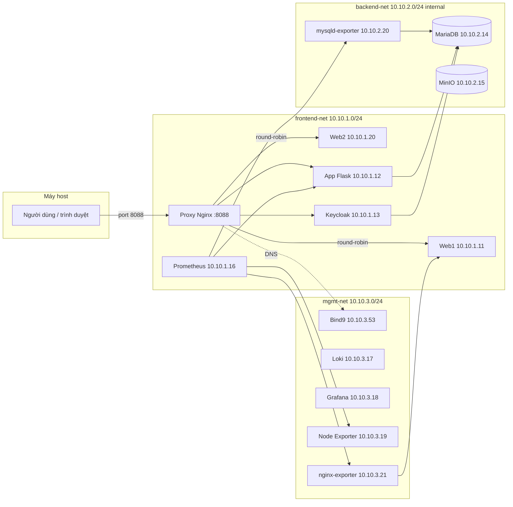

# MiniCloud — Kiến trúc hạ tầng & bảo mật

Tài liệu mô tả **toàn bộ stack** dự án MiniCloud: mạng, container, DNS nội bộ, reverse proxy, lưu trữ, giám sát, và **cách triển khai các lớp bảo mật** (phân vùng, bí mật, cổng vào). Cuối file là **hướng dẫn chạy** từ máy dev.

---

## 1. Tổng quan

MiniCloud là một cụm **Docker Compose** gồm **14 container** (không tính các container phụ trợ build), chạy trên **3 mạng ảo** để tách:

- lớp **người dùng / HTTP** (web1, web2, API, auth),
- lớp **dữ liệu** (MariaDB, MinIO) **không ra Internet**,
- lớp **vận hành** (DNS, metrics, logs).

**Cổng mở ra máy host (theo `docker-compose.yml`):**

| Cổng host | Dịch vụ | Ghi chú |
|-----------|---------|---------|
| `8088:80` | Nginx **Proxy** — cửa vào duy nhất cho HTTP tới ứng dụng | Bind `0.0.0.0:8088` |
| `443` | Nginx **Proxy** — HTTPS (dự phòng) | |
| `53/udp` | **Bind9** — DNS nội bộ | |
| `3000` | **Grafana** — dashboard (metrics/logs) | |
| `9001` | **MinIO Console** — giao diện quản trị bucket | |
| `127.0.0.1:9090` | **Prometheus** — chỉ bind localhost, không public | |

Các dịch vụ khác (Loki, MinIO API S3 `:9000`, mysqld-exporter `:9104`, nginx-exporter `:9113`, node-exporter `:9100`) **không** map cổng ra host; truy cập nội bộ qua mạng Docker.

---

## 2. Sơ đồ luồng (tóm tắt)



---

## 3. Ba mạng Docker (micro-segmentation)

| Mạng | Subnet | Đặc điểm | Vai trò |
|------|--------|----------|---------|
| `frontend-net` | `10.10.1.0/24` | Bridge thông thường | **Proxy**, **Web1/2**, **App**, **Keycloak**, **Prometheus** — lớp HTTP/HTTPS nội bộ. |
| `backend-net` | `10.10.2.0/24` | **`internal: true`** — container **không có default route ra Internet** | **MariaDB**, **MinIO**, **mysqld-exporter** — chỉ các service được gắn mạng này mới nói chuyện trực tiếp với DB/Storage. |
| `mgmt-net` | `10.10.3.0/24` | Bridge | **DNS**, **Loki**, **Grafana**, **Node Exporter**, **nginx-exporter**, và địa chỉ IP cố định cho các service cần tên ổn định. |

**Ý nghĩa bảo mật:** tách biệt "mặt tiền" (HTTP) và "kho dữ liệu"; backend không tự truy cập Internet, giảm bề mặt tấn công và rò rỉ dữ liệu ra ngoài qua stack IP mặc định.

---

## 4. Danh sách container & địa chỉ IP cố định

| # | Tên container | Image / build | IP (mạng) | Vai trò |
|---|--------------|---------------|-----------|---------|
| 1 | `minicloud-dns` | `build: ./bind9` | `10.10.3.53` (mgmt) | Bind9 — phân giải tên `*.cloud.local`. |
| 2 | `minicloud-proxy` | `nginx:alpine` | `10.10.1.10` (fe), `10.10.3.10` (mgmt) | **Gateway** — reverse proxy, port host **8088**. |
| 3 | `minicloud-web1` | `build: ./web` | `10.10.1.11` (fe), `10.10.3.11` (mgmt) | Static site — instance #1 (round-robin). |
| 4 | `minicloud-web2` | `build: ./web` | `10.10.1.20` (fe), `10.10.3.20` (mgmt) | Static site — instance #2 (round-robin). |
| 5 | `minicloud-app` | `build: ./app` | `10.10.1.12` (fe), `10.10.2.12` (be), `10.10.3.12` (mgmt) | API Flask (port **8081** trong container). |
| 6 | `minicloud-auth` | `build: ./auth` (Keycloak) | `10.10.1.13` (fe), `10.10.2.13` (be), `10.10.3.13` (mgmt) | Keycloak — HTTP **8080**, management **9000**. |
| 7 | `minicloud-db` | `mariadb:10.11` | `10.10.2.14` (be), `10.10.3.14` (mgmt) | MariaDB. |
| 8 | `minicloud-storage` | `minio/minio` | `10.10.2.15` (be), `10.10.3.15` (mgmt) | MinIO (API 9000, console **9001** → host). |
| 9 | `minicloud-monitoring` | `prom/prometheus` | `10.10.1.16` (fe), `10.10.3.16` (mgmt) | Prometheus `:9090` (bind `127.0.0.1`). |
| 10 | `minicloud-loki` | `grafana/loki` | `10.10.3.17` (mgmt) | Loki log aggregation. |
| 11 | `minicloud-grafana` | `grafana/grafana` | `10.10.3.18` (mgmt) | Grafana `:3000` (map host). |
| 12 | `minicloud-node-exporter` | `prom/node-exporter` | `10.10.3.19` (mgmt) | Metrics host (port 9100 trong container). |
| 13 | `minicloud-mysqld-exporter` | `prom/mysqld-exporter` | `10.10.2.20` (be), `10.10.3.22` (mgmt) | MariaDB metrics → Prometheus (port **9104**). |
| 14 | `minicloud-nginx-exporter` | `nginx/nginx-prometheus-exporter` | `10.10.3.21` (mgmt) | Nginx metrics → Prometheus (port **9113**). |

**Volumes bền vững:** `db_data` (MariaDB), `storage_data` (MinIO).

---

## 5. DNS nội bộ (Bind9)

- Tất cả service có `dns: 10.10.3.53` dùng **Bind9** làm resolver.
- Zone `cloud.local` ánh xạ tên → IP.
- **Nginx Proxy** (`nginx.conf`) dùng `resolver 10.10.3.53` và `proxy_pass` tới `http://app.cloud.local:8081`, `http://auth.cloud.local:8080`.

### Bảng bản ghi DNS (zone `cloud.local`)

| Hostname | IP | Ghi chú |
|----------|----|---------|
| `proxy.cloud.local` | `10.10.1.10` | Nginx Gateway |
| `web.cloud.local` / `web1.cloud.local` | `10.10.1.11` | Web instance #1 |
| `web2.cloud.local` | `10.10.1.20` | Web instance #2 |
| `app.cloud.local` | `10.10.1.12` | Flask API |
| `auth.cloud.local` | `10.10.1.13` | Keycloak |
| `db.cloud.local` | `10.10.2.14` | MariaDB |
| `storage.cloud.local` | `10.10.2.15` | MinIO |
| `monitoring.cloud.local` | `10.10.3.16` | Prometheus |
| `grafana.cloud.local` | `10.10.3.18` | Grafana |
| `dns.cloud.local` | `10.10.3.53` | Bind9 |
| `minio.cloud.local` | `10.10.2.15` | Alias MinIO (mục 6) |
| `keycloak.cloud.local` | `10.10.1.13` | Alias Keycloak (mục 6) |
| `app-backend.cloud.local` | `10.10.1.12` | Alias App backend (mục 6) |

Kiểm tra DNS (PowerShell):
```powershell
docker exec minicloud-dns sh -c "dig @127.0.0.1 minio.cloud.local A +short; dig @127.0.0.1 keycloak.cloud.local A +short; dig @127.0.0.1 app-backend.cloud.local A +short"
```

---

## 6. Reverse proxy (Nginx) — định tuyến người dùng

| Path trên Proxy (`:8088`) | Backend | Ghi chú |
|--------------------------|---------|---------|
| `/` | `web1` / `web2` (round-robin) | Giao diện tĩnh — load balance 2 instance. |
| `/api/` | `app.cloud.local:8081` | API Flask. |
| `/auth/` | `auth.cloud.local:8080` | Keycloak (OIDC). |
| `/student/` | `app.cloud.local:8081` | API/module sinh viên. |

---

## 7. Triển khai bảo mật bên trong

### 7.1 Docker Secrets (mật khẩu không nằm trong image)

| Secret | Dùng cho |
|--------|----------|
| `db_password` | MariaDB user app; Keycloak; **mysqld-exporter** (đọc qua entrypoint script) |
| `db_root_password` | Root MariaDB |
| `kc_admin_password` | Keycloak admin |
| `storage_root_user` / `storage_root_pass` | MinIO root user/password |

**MariaDB:** `MARIADB_PASSWORD_FILE` / `MARIADB_ROOT_PASSWORD_FILE` trỏ tới file secret.  
**MinIO:** `MINIO_ROOT_USER_FILE` / `MINIO_ROOT_PASSWORD_FILE`.  
**mysqld-exporter:** entrypoint script đọc `/run/secrets/db_password` và build `DATA_SOURCE_NAME` trước khi chạy exporter — tránh password rỗng trong biến môi trường.

### 7.2 Phân vùng mạng

- `backend-net` **internal**: cô lập DB và object storage khỏi Internet.
- `mysqld-exporter` join cả `backend-net` (để reach DB) và `mgmt-net` (để Prometheus scrape) — không expose port ra host.
- `nginx-exporter` chỉ trong `mgmt-net`, scrape `stub_status` từ web1 qua IP nội bộ `10.10.3.11`.

### 7.3 Cửa vào duy nhất cho HTTP(S) ứng dụng

- Chỉ **Proxy** bind `8088`/`443` trên host; Web/App/Auth không map port ra host.

### 7.4 Healthcheck & thứ tự khởi động

- `depends_on: condition: service_healthy` đảm bảo **DB**, **DNS** → **App/Web/Auth** → **Proxy**.
- `start_period` (App: 15s, Auth: 60s) giảm báo sai **unhealthy** khi máy tải cao.
- Keycloak health URL: **`127.0.0.1:9000/auth/health/ready`** (management port, `KC_HTTP_RELATIVE_PATH=/auth`).

### 7.5 Image Auth tùy biến (`auth/Dockerfile`)

- Build **multi-stage** từ `ubi9/ubi-minimal`: copy `curl` vào image Keycloak để healthcheck HTTP hoạt động tin cậy.

### 7.6 Lưu ý (độ "production" / đồ án)

- Keycloak chạy **`start-dev`** — phù hợp lab, không phải profile production.
- `KC_DB_PASSWORD` và `KEYCLOAK_ADMIN_PASSWORD` vẫn inject qua entrypoint script từ secret file.

---

## 8. Observability (Prometheus, Loki, Grafana)

### Prometheus scrape jobs

| Job | Target | Metrics |
|-----|--------|---------|
| `prometheus` | `localhost:9090` | Prometheus tự scrape |
| `node-exporter` | `minicloud-node-exporter:9100` | CPU, RAM, Disk, Network của host |
| `app` | `10.10.1.12:8081/metrics` | Flask app metrics (`prometheus_flask_exporter`) |
| `db` | `minicloud-mysqld-exporter:9104` | MariaDB metrics |
| `web` | `minicloud-nginx-exporter:9113` | Nginx connection metrics |

- **Loki** (`10.10.3.17`): tập trung log.
- **Grafana** (`3000` trên host): hiển thị metrics/logs; phụ thuộc Prometheus + Loki healthy.
- **Node Exporter** (`10.10.3.19`): metrics host (pid: host, mount `/proc`, `/sys`, `/`).

---

## 9. Cơ sở dữ liệu & script khởi tạo

- `db-init/001_init.sql` tạo database `studentdb`, bảng `students` và dữ liệu mẫu — chạy **chỉ khi volume `db_data` trống**.
- Đổi schema trên DB đã tồn tại: dùng migration/`docker exec` hoặc xóa volume (mất dữ liệu).

---

## 10. Cách chạy (đầy đủ)

### 10.1 Điều kiện

- **Docker** + **Docker Compose** plugin (`docker compose`).
- Đề xuất **≥ 4 GB** RAM tự do.

### 10.2 Chuẩn bị bí mật

Tạo thư mục `MiniCloud/secrets/` với các file (mỗi file **một dòng**, không dòng trống thừa):

```
secrets/
├── db_root_password.txt
├── db_password.txt
├── kc_admin_password.txt
├── storage_root_user.txt
└── storage_root_pass.txt
```

### 10.3 Biến môi trường (tùy chọn)

Copy `.env.example` thành `.env` và chỉnh:

- `DB_NAME` (mặc định `minicloud`)
- `DB_USER` (mặc định `admin`)

### 10.4 Khởi động cụm

```bash
cd MiniCloud

# Build + chạy nền
docker compose up -d --build

# Xem trạng thái & health
docker compose ps
```

Dừng / gỡ:

```bash
docker compose down
# Dữ liệu volume (MariaDB, MinIO) vẫn giữ trừ khi dùng `docker compose down -v`
```

### 10.5 Truy cập sau khi chạy

| Mục đích | URL | Credentials |
|----------|-----|-------------|
| Website + API qua gateway | `http://localhost:8088/` | — |
| API Flask | `http://localhost:8088/api/` | — |
| Keycloak (qua proxy) | `http://localhost:8088/auth/` | `admin` / `kc_admin_password.txt` |
| Grafana | `http://localhost:3000/` | `admin` / `admin` |
| Prometheus (chỉ local) | `http://localhost:9090/` | — |
| MinIO Console | `http://localhost:9001/` | `storage_root_user.txt` / `storage_root_pass.txt` |

### 10.6 Xem log khi lỗi

```bash
docker logs minicloud-app
docker logs minicloud-auth
docker logs minicloud-proxy
docker logs minicloud-mysqld-exporter
docker logs minicloud-nginx-exporter
```

---

## 11. Kiểm tra hệ thống

> Xem chi tiết đầy đủ trong [`KIEM_TRA_HE_THONG.md`](./KIEM_TRA_HE_THONG.md).

### 11.1 Kiểm tra nhanh — API Gateway

```bash
# Web frontend (round-robin web1/web2)
curl -I http://localhost:8088/

# App backend
curl -s http://localhost:8088/api/hello

# Auth (Keycloak)
curl -I http://localhost:8088/auth/
```

**Kết quả mong đợi:**
```
Web:  HTTP/1.1 200 OK  (Content-Type: text/html)
App:  {"message": "Hello from Modular App Server!"}
Auth: HTTP/1.1 302 Found  (Location: /auth/admin/)
```

### 11.2 Kiểm tra Prometheus targets

```bash
docker exec minicloud-monitoring wget -qO- \
  "http://localhost:9090/api/v1/targets?state=active" | \
  python3 -c "import sys,json; targets=json.load(sys.stdin)['data']['activeTargets']; [print(t['labels']['job'], '-', t['health']) for t in targets]"
```

**Kết quả mong đợi:**
```
app           - up
db            - up
node-exporter - up
prometheus    - up
web           - up
```

### 11.3 Kiểm tra thông mạng nội bộ

```bash
docker exec minicloud-app sh -c "
echo '=== proxy     (10.10.1.10) ===' && ping -c 2 proxy.cloud.local   2>&1 | tail -2
echo '=== web1      (10.10.1.11) ===' && ping -c 2 web1.cloud.local    2>&1 | tail -2
echo '=== web2      (10.10.1.20) ===' && ping -c 2 web2.cloud.local    2>&1 | tail -2
echo '=== db        (10.10.2.14) ===' && ping -c 2 db.cloud.local      2>&1 | tail -2
echo '=== storage   (10.10.2.15) ===' && ping -c 2 storage.cloud.local 2>&1 | tail -2
echo '=== grafana   (10.10.3.18) ===' && ping -c 2 grafana.cloud.local 2>&1 | tail -2
"
```

### 11.4 Kiểm tra containers

```bash
docker ps --format "table {{.Names}}\t{{.Status}}\t{{.Ports}}"
```

---

## 12. Tóm tắt Port & Credentials

| Service | Port host | URL | Credentials |
|---------|-----------|-----|-------------|
| Nginx proxy | **8088** | `http://localhost:8088` | — |
| Keycloak Admin | 8088/auth | `http://localhost:8088/auth` | `admin` / `kc_admin_password.txt` |
| MinIO Console | **9001** | `http://localhost:9001` | `storage_root_user.txt` / `storage_root_pass.txt` |
| Grafana | **3000** | `http://localhost:3000` | `admin` / `admin` |
| Prometheus | **9090** (localhost only) | `http://localhost:9090` | — |
| DNS (nội bộ) | 53/udp | — | — |
| mysqld-exporter | 9104 (nội bộ) | — | — |
| nginx-exporter | 9113 (nội bộ) | — | — |
| node-exporter | 9100 (nội bộ) | — | — |

---

## 13. Tóm tắt

MiniCloud dùng **ba lớp mạng**, **DNS nội bộ**, **Nginx reverse proxy** (port **8088**) với **round-robin** qua 2 web instance, **Docker Secrets** cho DB/MinIO/exporter, **healthcheck** và **depends_on** để khởi động có thứ tự, và stack **Prometheus + Loki + Grafana** với đầy đủ 5 scrape jobs (`prometheus`, `node-exporter`, `app`, `db`, `web`) để quan sát toàn diện. Một số chỗ (Keycloak `start-dev`) phù hợp **môi trường lab**; nâng cấp production cần siết chặt profile Keycloak.
