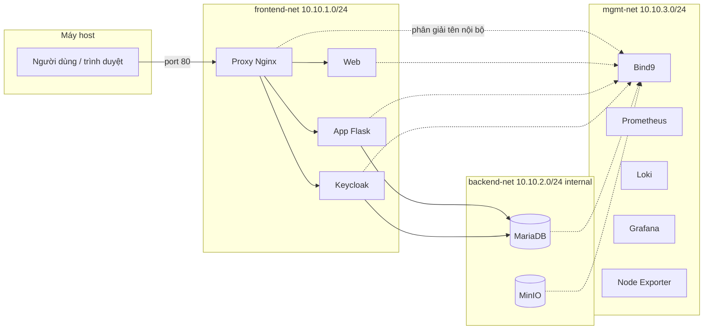

# MiniCloud — Kiến trúc hạ tầng & bảo mật

Tài liệu mô tả **toàn bộ stack** dự án MiniCloud: mạng, container, DNS nội bộ, reverse proxy, lưu trữ, giám sát, và **cách triển khai các lớp bảo mật** (phân vùng, bí mật, cổng vào). Cuối file là **hướng dẫn chạy** từ máy dev.

---

## 1. Tổng quan

MiniCloud là một cụm **Docker Compose** gồm **11 container** (không tính các container phụ trợ build), chạy trên **3 mạng ảo** để tách:

- lớp **người dùng / HTTP** (web, API, auth),
- lớp **dữ liệu** (MariaDB, MinIO) **không ra Internet**,
- lớp **vận hành** (DNS, metrics, logs).

**Cổng mở ra máy host (theo `docker-compose.yml`):**

| Cổng host | Dịch vụ |
|-----------|---------|
| `80`, `443` | Nginx **Proxy** — cửa vào duy nhất cho HTTP(S) tới ứng dụng |
| `53/udp` | **Bind9** — DNS nội bộ (có thể map tới host để debug) |
| `3000` | **Grafana** — dashboard (metrics/logs) |
| `9001` | **MinIO Console** — giao diện quản trị bucket |

Các dịch vụ khác (Prometheus, Loki, MinIO API S3 `:9000`, …) **không** map cổng ra host trừ khi chỉnh thêm; truy cập nội bộ qua mạng Docker.

---

## 2. Sơ đồ luồng (tóm tắt)



---

## 3. Ba mạng Docker (micro-segmentation)

| Mạng | Subnet | Đặc điểm | Vai trò |
|------|--------|----------|---------|
| `frontend-net` | `10.10.1.0/24` | Bridge thông thường | **Proxy**, **Web**, **App**, **Keycloak** — lớp HTTP/HTTPS nội bộ. |
| `backend-net` | `10.10.2.0/24` | **`internal: true`** — container **không có default route ra Internet** | **MariaDB**, **MinIO** — chỉ các service được gắn mạng này mới nói chuyện trực tiếp với DB/Storage. |
| `mgmt-net` | `10.10.3.0/24` | Bridge | **DNS**, **Prometheus**, **Loki**, **Grafana**, **Node Exporter**, và địa chỉ IP cố định cho các service cần tên ổn định. |

**Ý nghĩa bảo mật:** tách biệt “mặt tiền” (HTTP) và “kho dữ liệu”; backend không tự truy cập Internet, giảm bề mặt tấn công và rò rỉ dữ liệu ra ngoài qua stack IP mặc định.

---

## 4. Danh sách container & địa chỉ IP cố định

Mỗi service quan trọng **gán IP tĩnh** trong `docker-compose.yml` để dịch vụ và DNS có thể tham chiếu nhất quán.

| # | Tên container | Image / build | IP chính (mạng) | Vai trò |
|---|------------------|---------------|------------------|---------|
| 1 | `minicloud-dns` | `build: ./bind9` | `10.10.3.53` (mgmt) | Bind9 — phân giải tên `*.cloud.local`. |
| 2 | `minicloud-proxy` | `nginx:alpine` | `10.10.1.10` (fe), `10.10.3.10` (mgmt) | **Gateway** — reverse proxy tới web, app, auth. |
| 3 | `minicloud-web` | `build: ./web` | `10.10.1.11`, `10.10.3.11` | Static site (Nginx). |
| 4 | `minicloud-app` | `build: ./app` | `10.10.1.12`, `10.10.2.12`, `10.10.3.12` | API Flask (port **8081** trong container). |
| 5 | `minicloud-auth` | `build: ./auth` (Keycloak + curl) | `10.10.1.13`, `10.10.2.13`, `10.10.3.13` | Keycloak — HTTP **8080**, management **9000** (health). |
| 6 | `minicloud-db` | `mariadb:10.11` | `10.10.2.14`, `10.10.3.14` | MariaDB. |
| 7 | `minicloud-storage` | `minio/minio` | `10.10.2.15`, `10.10.3.15` | MinIO (API 9000, console 9001 trong container). |
| 8 | `minicloud-monitoring` | `prom/prometheus` | `10.10.3.16` | Prometheus `:9090`. |
| 9 | `minicloud-loki` | `grafana/loki` | `10.10.3.17` | Loki log aggregation. |
| 10 | `minicloud-grafana` | `grafana/grafana` | `10.10.3.18` | Grafana `:3000` (map host). |
| 11 | `minicloud-node-exporter` | `prom/node-exporter` | `10.10.3.19` | Metrics host (port 9100 trong container). |

**Volumes bền vững:** `db_data` (MariaDB), `storage_data` (MinIO).

---

## 5. DNS nội bộ (Bind9)

- Tất cả service có `dns: 10.10.3.53` dùng **Bind9** làm resolver.
- Zone `db.cloud.local` ánh xạ tên → IP (ví dụ `app.cloud.local` → `10.10.1.12`, `db.cloud.local` → `10.10.2.14`).
- **Nginx Proxy** (`nginx.conf`) dùng `resolver 10.10.3.53` và `proxy_pass` tới `http://web.cloud.local`, `http://app.cloud.local:8081`, `http://auth.cloud.local:8080` để **upstream theo tên**, không hardcode IP trong từng `location` (trừ resolver).

**Bảo mật / vận hành:** Tên miền nội bộ giúp xoay vòng cấu hình rõ ràng; không publish DB/MinIO trực tiếp ra host qua DNS công cộng.

---

## 6. Reverse proxy (Nginx) — định tuyến người dùng

| Path trên Proxy (`:80`) | Backend | Ghi chú |
|-------------------------|---------|---------|
| `/` | `web.cloud.local:80` | Giao diện tĩnh. |
| `/api/` | `app.cloud.local:8081` | API Flask. |
| `/auth/` | `auth.cloud.local:8080` | Keycloak (OIDC). |
| `/student/` | `app.cloud.local:8081` | API/module sinh viên (định tuyến tới cùng app). |

Header chuẩn: `Host`, `X-Real-IP` (và có thể mở rộng `X-Forwarded-*` khi bật HTTPS).

---

## 7. Triển khai bảo mật bên trong

### 7.1 Docker Secrets (mật khẩu không nằm trong image)

Các file trong `./secrets/` được mount vào container dưới dạng **Docker Secrets** (tạm thời trong `/run/secrets/`), tránh lưu mật khẩu trực tiếp trong biến môi trường cho các thành phần sau:

| Secret | Dùng cho |
|--------|----------|
| `db_password` | MariaDB user app; **được mount** cho Keycloak (file) — nhưng xem mục 7.4. |
| `db_root_password` | Root MariaDB |
| `kc_admin_password` | Keycloak admin (file secret) |
| `storage_root_user` / `storage_root_pass` | MinIO root user/password |

**MariaDB:** `MARIADB_PASSWORD_FILE` / `MARIADB_ROOT_PASSWORD_FILE` trỏ tới file secret.  
**MinIO:** `MINIO_ROOT_USER_FILE` / `MINIO_ROOT_PASSWORD_FILE`.

### 7.2 Phân vùng mạng

- `backend-net` **internal**: cô lập DB và object storage khỏi Internet.
- Chỉ process có interface trên `backend-net` (App, Auth, DB, Storage) mới giao tiếp trực tiếp với DB/MinIO theo thiết kế.

### 7.3 Cửa vào duy nhất cho HTTP(S) ứng dụng

- Chỉ **Proxy** bind `80`/`443` trên host; Web/App/Auth không map port ra host (trừ khi bạn chỉnh thêm).

### 7.4 Healthcheck & thứ tự khởi động

- `depends_on: condition: service_healthy` đảm bảo **DB**, **DNS**, rồi **App/Web/Auth** sẵn sàng trước khi **Proxy** lên.
- `start_period` (App: 15s, Auth: 30s) giảm báo sai **unhealthy** khi máy tải cao.
- Keycloak **26+**: readiness HTTP qua management port `9000`; với cấu hình `KC_HTTP_RELATIVE_PATH=/auth`, health URL đúng là **`127.0.0.1:9000/auth/health/ready`**.

### 7.5 Image Auth tùy biến (`auth/Dockerfile`)

- `FROM quay.io/keycloak/keycloak:latest` — image upstream **không có** `curl`/`microdnf` đủ để cài gói theo cách RPM đơn giản.
- Build **multi-stage** từ `ubi9/ubi-minimal`: copy `curl` và thư viện phụ thuộc vào image Keycloak để healthcheck **HTTP** hoạt động tin cậy.

### 7.6 Lưu ý (độ “production” / đồ án)

- Trong `docker-compose.yml`, **Keycloak** vẫn đặt **`KC_DB_PASSWORD`**, **`KEYCLOAK_ADMIN_PASSWORD`** dạng chuỗi trong `environment` (môi trường dev). **Không** lý tưởng cho production; hướng cải thiện: dùng secret file + entrypoint script, hoặc chỉ inject qua file/env từ secret manager.
- Keycloak chạy **`start-dev`** — phù hợp lab, **không** phải profile production Keycloak.

---

## 8. Observability (Prometheus, Loki, Grafana)

- **Prometheus** (`10.10.3.16:9090`): thu thập metrics (cấu hình scrape có thể bổ sung).
- **Loki** (`10.10.3.17`): tập trung log.
- **Grafana** (`3000` trên host): hiển thị metrics/logs; phụ thuộc Prometheus + Loki healthy.
- **Node Exporter** (`10.10.3.19`): metrics host.

---

## 9. Cơ sở dữ liệu & script khởi tạo

- Thư mục `db-init/` được mount vào `/docker-entrypoint-initdb.d` (read-only). MariaDB chạy các file `.sql` **chỉ khi khởi tạo volume `db_data` lần đầu** (volume trống).
- File `db-init/001_init.sql` tạo database `studentdb`, bảng `students` và dữ liệu mẫu. Đổi schema trên DB đã tồn tại: dùng migration/`docker exec` hoặc xóa volume (mất dữ liệu).

---

## 10. Cách chạy (đầy đủ)

### 10.1 Điều kiện

- **Docker** + **Docker Compose** plugin (`docker compose`).
- Windows / macOS / Linux: đảm bảo đủ RAM (đề xuất **≥ 4 GB** tự do cho nhiều container).

### 10.2 Chuẩn bị bí mật

Tạo thư mục `MiniCloud/secrets/` với các file (mỗi file **một dòng** nội dung, không dòng trống thừa nếu image yêu cầu):

- `db_root_password.txt`
- `db_password.txt`
- `kc_admin_password.txt`
- `storage_root_user.txt`
- `storage_root_pass.txt`

**Quan trọng:** Mật khẩu trong `db_password.txt` phải **khớp** với `KC_DB_PASSWORD` trong compose nếu Keycloak kết nối DB bằng biến môi trường đó (hiện đang hardcode trong compose — cần đồng bộ tay khi đổi secret).

### 10.3 Biến môi trường (tùy chọn)

Copy `.env.example` thành `.env` và chỉnh:

- `DB_NAME` (mặc định `minicloud`)
- `DB_USER` (mặc định `admin`)

### 10.4 Khởi động cụm

```bash
cd MiniCloud

# Build + chạy nền
docker compose up -d --build

# Xem trạng thái & health
docker compose ps
```

Dừng / gỡ:

```bash
docker compose down
# Dữ liệu volume (MariaDB, MinIO) vẫn giữ trừ khi dùng `docker compose down -v`
```

### 10.5 Truy cập sau khi chạy

| Mục đích | URL |
|----------|-----|
| Website + API qua gateway | `http://localhost/` , `http://localhost/api/` |
| Keycloak (qua proxy) | `http://localhost/auth/` |
| Grafana | `http://localhost:3000/` |

*(MinIO Console đã map cổng host: `http://localhost:9001/`.)*

### 10.6 Xem log khi lỗi

```bash
docker logs minicloud-app
docker logs minicloud-auth
docker logs minicloud-proxy
```

---

## 11. Tóm tắt

MiniCloud dùng **ba lớp mạng**, **DNS nội bộ**, **Nginx reverse proxy**, **Docker Secrets** cho DB/MinIO, **healthcheck** và **depends_on** để khởi động có thứ tự, và stack **Prometheus + Loki + Grafana** để quan sát. Một số chỗ (mật khẩu Keycloak trong env, Keycloak `start-dev`) phù hợp **môi trường lab**; nâng cấp production cần siết chặt bí mật và profile Keycloak.
