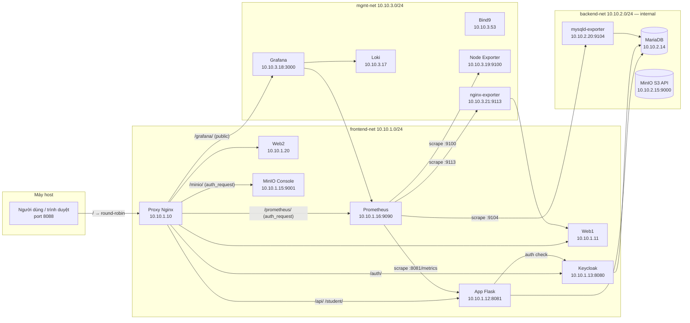

# MiniCloud — Kiến trúc hạ tầng & bảo mật

Tài liệu mô tả **toàn bộ stack** dự án MiniCloud: mạng, container, DNS nội bộ, reverse proxy, lưu trữ, giám sát, và **cách triển khai các lớp bảo mật** (phân vùng, bí mật, cổng vào). Cuối file là **hướng dẫn chạy** từ máy dev.

---

## 1. Tổng quan

MiniCloud là một cụm **Docker Compose** gồm **14 container**, chạy trên **3 mạng ảo** để tách:

- lớp **người dùng / HTTP** (web1, web2, API, auth),
- lớp **dữ liệu** (MariaDB, MinIO) **không ra Internet**,
- lớp **vận hành** (DNS, metrics, logs).

**Cổng mở ra máy host (theo `docker-compose.yml`):**

| Cổng host | Dịch vụ | Ghi chú |
|-----------|---------|---------|
| `8088:80` | Nginx **Proxy** — **cửa vào duy nhất** cho toàn bộ HTTP | Bind `0.0.0.0:8088` |
| `443` | Nginx **Proxy** — HTTPS (dự phòng) | |
| `53/udp` | **Bind9** — DNS nội bộ | |

> **Lưu ý quan trọng:** Grafana (3000), MinIO Console (9001), Prometheus (9090) **không expose port ra host**. Tất cả truy cập đều qua proxy port **8088**.

---

## 2. Sơ đồ luồng



---

## 3. Ba mạng Docker (micro-segmentation)

| Mạng | Subnet | Đặc điểm | Vai trò |
|------|--------|----------|---------|
| `frontend-net` | `10.10.1.0/24` | Bridge thông thường | Proxy, Web1/2, App, Keycloak, Prometheus, MinIO (frontend IP) |
| `backend-net` | `10.10.2.0/24` | **`internal: true`** — không có default route ra Internet | MariaDB, MinIO (S3 API), mysqld-exporter |
| `mgmt-net` | `10.10.3.0/24` | Bridge | DNS, Loki, Grafana, Node Exporter, nginx-exporter, Redis |

**Ý nghĩa bảo mật:** `backend-net` cô lập DB và object storage khỏi Internet. Chỉ các service được gắn mạng này mới nói chuyện trực tiếp với DB/Storage.

---

## 4. Danh sách container & địa chỉ IP cố định

| # | Tên container | Image / build | IP (mạng) | Vai trò |
|---|--------------|---------------|-----------|---------|
| 1 | `minicloud-dns` | `build: ./bind9` | `10.10.3.53` (mgmt) | Bind9 — phân giải `*.cloud.local` |
| 2 | `minicloud-proxy` | `nginx:alpine` | `10.10.1.10` (fe), `10.10.3.10` (mgmt) | **Gateway duy nhất** — port host **8088** |
| 3 | `minicloud-web1` | `build: ./web` | `10.10.1.11` (fe), `10.10.3.11` (mgmt) | Static site — instance #1 (round-robin) |
| 4 | `minicloud-web2` | `build: ./web` | `10.10.1.20` (fe), `10.10.3.20` (mgmt) | Static site — instance #2 (round-robin) |
| 5 | `minicloud-app` | `build: ./app` | `10.10.1.12` (fe), `10.10.2.12` (be), `10.10.3.12` (mgmt) | API Flask — port **8081** trong container |
| 6 | `minicloud-auth` | `build: ./auth` (Keycloak) | `10.10.1.13` (fe), `10.10.2.13` (be), `10.10.3.13` (mgmt) | Keycloak — HTTP **8080**, management **9000** |
| 7 | `minicloud-db` | `mariadb:10.11` | `10.10.2.14` (be), `10.10.3.14` (mgmt) | MariaDB |
| 8 | `minicloud-storage` | `minio/minio` | `10.10.2.15` (be), `10.10.3.15` (mgmt), `10.10.1.15` (fe) | MinIO — S3 API **9000**, Console **9001** |
| 9 | `minicloud-monitoring` | `prom/prometheus` | `10.10.1.16` (fe), `10.10.3.16` (mgmt) | Prometheus — port **9090** (nội bộ) |
| 10 | `minicloud-loki` | `grafana/loki` | `10.10.3.17` (mgmt) | Loki log aggregation |
| 11 | `minicloud-grafana` | `grafana/grafana` | `10.10.1.18` (fe), `10.10.3.18` (mgmt) | Grafana — port **3000** (nội bộ) |
| 12 | `minicloud-node-exporter` | `prom/node-exporter` | `10.10.3.19` (mgmt) | Metrics host — port **9100** |
| 13 | `minicloud-mysqld-exporter` | `prom/mysqld-exporter` | `10.10.2.20` (be), `10.10.3.22` (mgmt) | MariaDB metrics — port **9104** |
| 14 | `minicloud-nginx-exporter` | `nginx/nginx-prometheus-exporter` | `10.10.3.21` (mgmt) | Nginx metrics — port **9113** |
| 15 | `minicloud-redis` | `redis:7-alpine` | `10.10.2.16` (be), `10.10.3.23` (mgmt) | Redis cache — port **6379** |

**Volumes bền vững:** `db_data` (MariaDB), `storage_data` (MinIO).

---

## 5. DNS nội bộ (Bind9)

Tất cả service có `dns: 10.10.3.53`. Zone `cloud.local` ánh xạ tên → IP cố định.

| Hostname | IP | Ghi chú |
|----------|----|---------|
| `proxy.cloud.local` | `10.10.1.10` | Nginx Gateway |
| `web1.cloud.local` / `web-frontend-server.cloud.local` | `10.10.1.11` | Web instance #1 |
| `web2.cloud.local` | `10.10.1.20` | Web instance #2 |
| `app.cloud.local` / `app-backend.cloud.local` | `10.10.1.12` | Flask API |
| `auth.cloud.local` / `keycloak.cloud.local` | `10.10.1.13` | Keycloak |
| `db.cloud.local` | `10.10.2.14` | MariaDB |
| `storage.cloud.local` / `minio.cloud.local` | `10.10.2.15` | MinIO |
| `monitoring.cloud.local` | `10.10.3.16` | Prometheus |
| `grafana.cloud.local` | `10.10.3.18` | Grafana |
| `dns.cloud.local` | `10.10.3.53` | Bind9 |

---

## 6. Reverse proxy (Nginx) — định tuyến & bảo mật

Nginx proxy là **cửa vào duy nhất** tại port **8088**. Mọi dịch vụ đều truy cập qua đây.

| Path | Backend | Bảo vệ |
|------|---------|--------|
| `/` | `web1` / `web2` (round-robin) | Public |
| `/api/` | `app.cloud.local:8081` | Public |
| `/student/` | `app.cloud.local:8081` | Public |
| `/auth/` | `auth:8080` | Public (Keycloak tự quản lý) |
| `/grafana/` | `10.10.1.18:3000` | Grafana tự quản lý auth |
| `/prometheus/` | `10.10.1.16:9090` | **`auth_request`** — cần cookie `mc_token` |
| `/minio/` | `10.10.1.15:9001` | **`auth_request`** — cần cookie `mc_token` |

**Cơ chế auth_request:** Nginx gọi `/_auth_check` → Flask `/api/auth/me-cookie` đọc cookie `mc_token` → nếu hợp lệ mới cho qua Prometheus/MinIO.

**Trang lỗi tùy chỉnh:**
- `401` / `403` → redirect `/401.html` (browser) hoặc JSON (API client)
- `404` → redirect `/404.html` (browser) hoặc JSON (API client)

---

## 7. Triển khai bảo mật

### 7.1 Docker Secrets

| Secret | Dùng cho |
|--------|----------|
| `db_password` | MariaDB user app, Keycloak, mysqld-exporter |
| `db_root_password` | Root MariaDB |
| `kc_admin_password` | Keycloak admin |
| `storage_root_user` / `storage_root_pass` | MinIO root credentials |

### 7.2 Phân vùng mạng

- `backend-net` **internal**: DB và MinIO không tự kết nối Internet.
- Proxy, Web, App không map port trực tiếp ra host — chỉ qua Nginx.

### 7.3 Healthcheck & thứ tự khởi động

- `depends_on: condition: service_healthy`: DNS → DB → App/Web/Auth → Proxy.
- Keycloak health: `127.0.0.1:9000/auth/health/ready` (management port).

---

## 8. Observability (Prometheus + Loki + Grafana)

### Prometheus scrape jobs

| Job | Target | Metrics |
|-----|--------|---------|
| `prometheus` | `localhost:9090` | Prometheus tự scrape |
| `node-exporter` | `minicloud-node-exporter:9100` | CPU, RAM, Disk, Network host |
| `app` | `10.10.1.12:8081/metrics` | Flask app metrics |
| `db` | `minicloud-mysqld-exporter:9104` | MariaDB metrics |
| `web` | `10.10.3.11:80/stub_status`, `10.10.3.20:80/stub_status` | Nginx connection metrics (web1 & web2) |
| `nginx-exporter` | `minicloud-nginx-exporter:9113` | nginx-exporter self metrics |

---

## 9. Cách chạy

### 9.1 Điều kiện

- **Docker** + **Docker Compose** plugin.
- Đề xuất **≥ 4 GB** RAM tự do.

### 9.2 Chuẩn bị secrets

Tạo thư mục `MiniCloud/secrets/` với các file (mỗi file một dòng):

```
secrets/
├── db_root_password.txt
├── db_password.txt
├── kc_admin_password.txt
├── storage_root_user.txt
└── storage_root_pass.txt
```

### 9.3 Khởi động

```bash
cd MiniCloud
docker compose up -d --build
docker compose ps
```

Dừng:
```bash
docker compose down
# Giữ volume: không thêm flag
# Xóa volume: docker compose down -v
```

### 9.4 Truy cập sau khi chạy

| Mục đích | URL | Credentials |
|----------|-----|-------------|
| Website + API | `http://localhost:8088/` | — |
| Keycloak Admin | `http://localhost:8088/auth/admin` | `admin` / `keycloak_admin_super_secret_123!` |
| Grafana | `http://localhost:8088/grafana/` | `admin` / `admin` |
| Prometheus | `http://localhost:8088/prometheus/` | Cần đăng nhập trang chủ trước |
| MinIO Console | `http://localhost:8088/minio/` | Cần đăng nhập trang chủ trước |

> Truy cập từ máy khác trong LAN: thay `localhost` bằng IP máy chủ (vd: `http://10.0.205.103:8088`).

---

## 10. Kiểm tra hệ thống

> Xem chi tiết đầy đủ trong [`KIEM_TRA_HE_THONG.md`](./KIEM_TRA_HE_THONG.md).

```bash
# Kiểm tra nhanh
curl -I http://localhost:8088/
curl -s http://localhost:8088/api/hello
curl -I http://localhost:8088/auth/

# Trạng thái containers
docker ps --format "table {{.Names}}\t{{.Status}}\t{{.Ports}}"

# Prometheus targets
docker exec minicloud-monitoring wget -qO- \
  "http://localhost:9090/api/v1/targets?state=active" | \
  python3 -c "import sys,json; [print(t['labels']['job'],'-',t['health']) for t in json.load(sys.stdin)['data']['activeTargets']]"
```

---

## 11. Tóm tắt

MiniCloud dùng **3 lớp mạng** (micro-segmentation), **DNS nội bộ Bind9**, **Nginx reverse proxy** (port **8088**) là cửa vào duy nhất với round-robin qua 2 web instance, **auth_request** bảo vệ Prometheus và MinIO bằng cookie JWT, **Docker Secrets** cho tất cả credentials, và stack **Prometheus + Loki + Grafana** với 6 scrape jobs để quan sát toàn diện.
