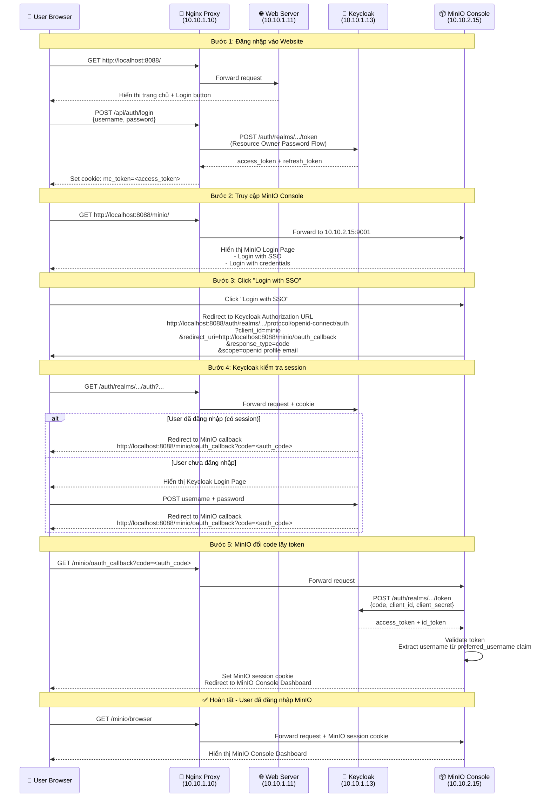
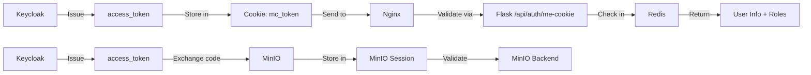
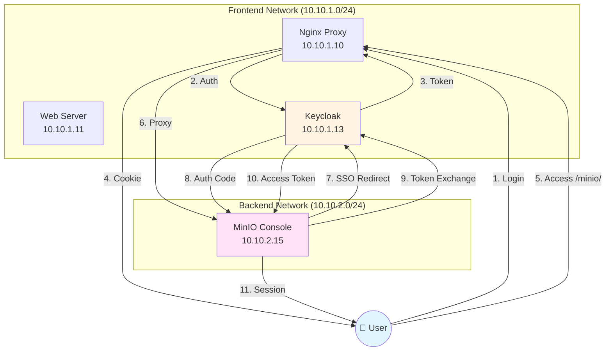

# MinIO SSO Flow Diagram

## 🔐 Luồng xác thực SSO (Single Sign-On)



---

## 🔄 Các luồng xác thực

### 1. Website Login (Resource Owner Password Flow)
```
User → Nginx → Keycloak
     ← access_token ←
```

**Đặc điểm:**
- Direct username/password
- Không có redirect
- Token lưu trong cookie `mc_token`

### 2. MinIO SSO (Authorization Code Flow)
```
User → MinIO → Keycloak (Authorization)
     ← auth_code ←
MinIO → Keycloak (Token Exchange)
      ← access_token ←
```

**Đặc điểm:**
- Redirect-based flow
- Secure (code exchange)
- Tận dụng Keycloak session

---

## 🔑 Token Flow

### Access Token Journey



---

## 🏗️ Kiến trúc SSO



---

## 📋 Cấu hình OIDC

### MinIO Environment Variables
```yaml
MINIO_IDENTITY_OPENID_CONFIG_URL: 
  "http://10.10.1.13:8080/auth/realms/realm_52300267/.well-known/openid-configuration"

MINIO_IDENTITY_OPENID_CLIENT_ID: "minio"

MINIO_IDENTITY_OPENID_CLIENT_SECRET: "<secret-from-keycloak>"

MINIO_IDENTITY_OPENID_SCOPES: "openid,profile,email"

MINIO_IDENTITY_OPENID_REDIRECT_URI: 
  "http://localhost:8088/minio/oauth_callback"

MINIO_IDENTITY_OPENID_CLAIM_NAME: "preferred_username"
```

### Keycloak Client Config
```json
{
  "clientId": "minio",
  "protocol": "openid-connect",
  "clientAuthenticatorType": "client-secret",
  "redirectUris": [
    "http://localhost:8088/minio/oauth_callback",
    "http://localhost:8088/minio/*"
  ],
  "webOrigins": ["http://localhost:8088"],
  "standardFlowEnabled": true,
  "directAccessGrantsEnabled": false
}
```

---

## 🔐 Security Features

### 1. Network Isolation
- MinIO nằm trong **backend-net** (internal)
- Chỉ Nginx có thể truy cập MinIO
- User không thể truy cập trực tiếp MinIO

### 2. Token Validation
- Keycloak validate token
- MinIO validate token với Keycloak
- Redis cache token cho Flask API

### 3. Session Management
- Keycloak session: 30 phút (configurable)
- MinIO session: theo token expiry
- Flask session: 15 phút (Redis TTL)

### 4. HTTPS Ready
- Nginx hỗ trợ SSL termination
- Keycloak hỗ trợ HTTPS
- MinIO hỗ trợ TLS

---

## 🎯 Benefits của SSO

✅ **Single Sign-On**: Đăng nhập 1 lần, dùng nhiều service  
✅ **Centralized Auth**: Quản lý user tập trung tại Keycloak  
✅ **Better UX**: Không cần nhập lại password  
✅ **Security**: Token-based, không lưu password  
✅ **Audit Trail**: Keycloak log tất cả login events  
✅ **Role-Based Access**: Keycloak roles → MinIO policies  

---

## 📊 Comparison: Trước vs Sau SSO

| Feature | Trước SSO | Sau SSO |
|---------|-----------|---------|
| **Login MinIO** | Username + Password riêng | Click "Login with SSO" |
| **User Management** | MinIO internal users | Keycloak centralized |
| **Password Reset** | MinIO admin phải reset | User tự reset qua Keycloak |
| **Multi-Factor Auth** | Không hỗ trợ | Keycloak MFA |
| **Session Timeout** | MinIO config | Keycloak config |
| **Audit Logs** | MinIO logs only | Keycloak + MinIO logs |

---

## 🧪 Testing Scenarios

### Scenario 1: Happy Path
1. ✅ User đăng nhập website
2. ✅ Truy cập MinIO Console
3. ✅ Click "Login with SSO"
4. ✅ Auto-redirect về MinIO Dashboard

### Scenario 2: No Website Login
1. ❌ User chưa đăng nhập website
2. ✅ Truy cập MinIO Console
3. ✅ Click "Login with SSO"
4. ✅ Redirect đến Keycloak login page
5. ✅ Nhập credentials
6. ✅ Redirect về MinIO Dashboard

### Scenario 3: Session Expired
1. ✅ User đã đăng nhập (session cũ)
2. ⏰ Session Keycloak hết hạn
3. ✅ Truy cập MinIO Console
4. ✅ Click "Login with SSO"
5. ✅ Keycloak yêu cầu đăng nhập lại
6. ✅ Redirect về MinIO Dashboard

### Scenario 4: Root User Login
1. ✅ Truy cập MinIO Console
2. ✅ Chọn "Login with credentials"
3. ✅ Nhập root username/password
4. ✅ Vào MinIO Dashboard với full admin rights

---

**Version**: 2.1  
**Last Updated**: April 15, 2026  
**Status**: ✅ Production Ready
